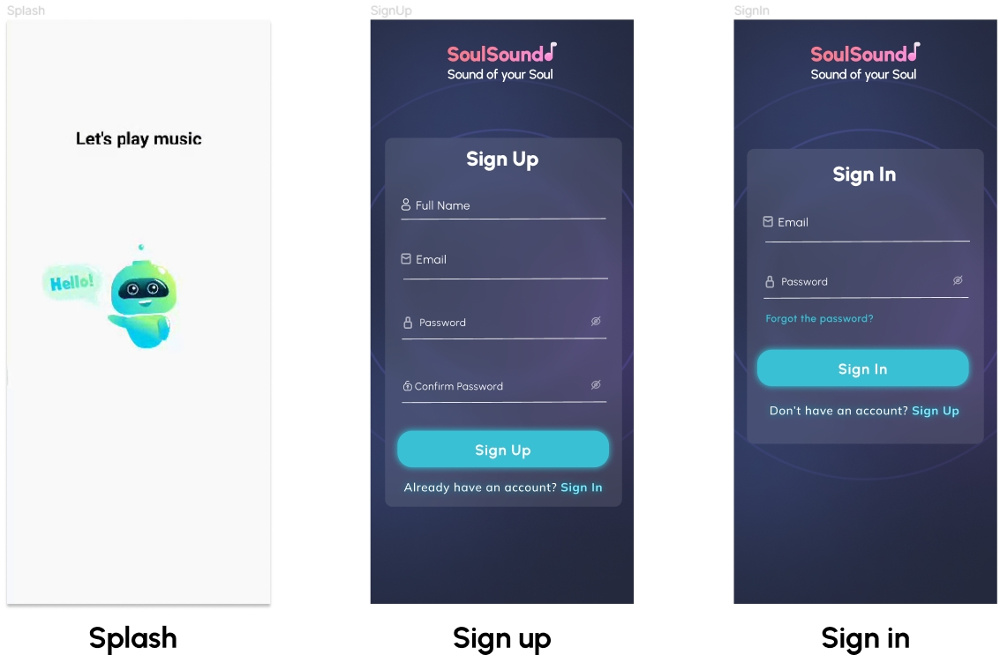
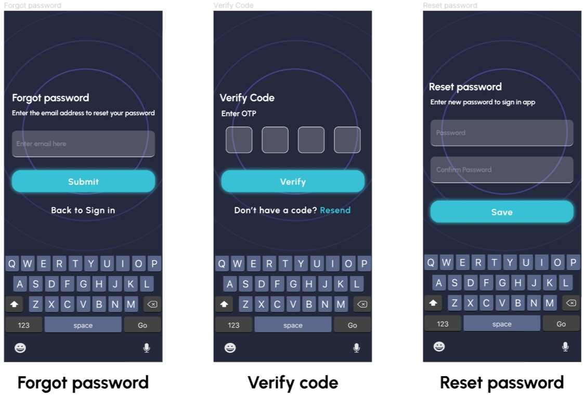
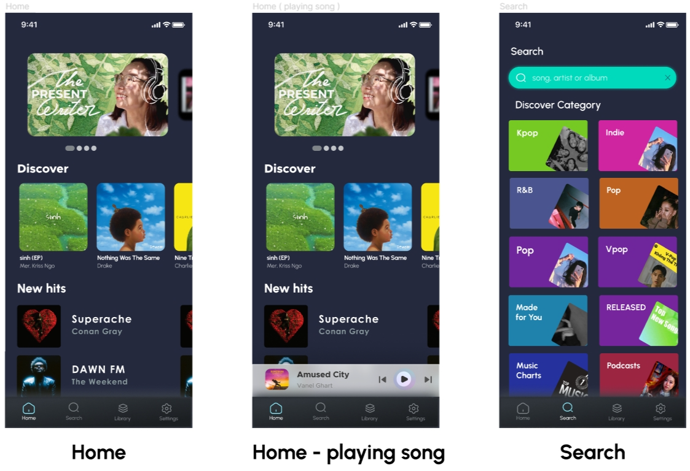
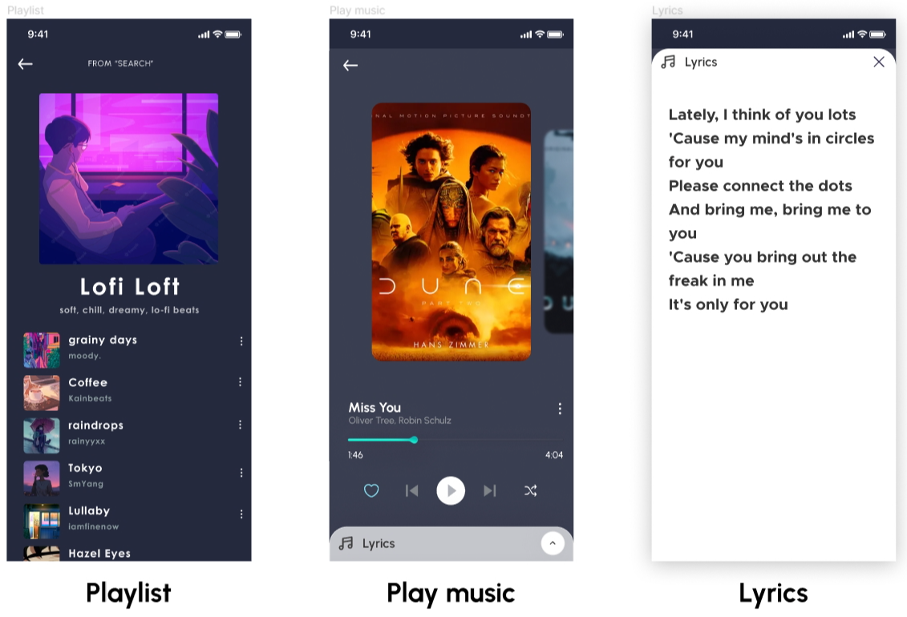
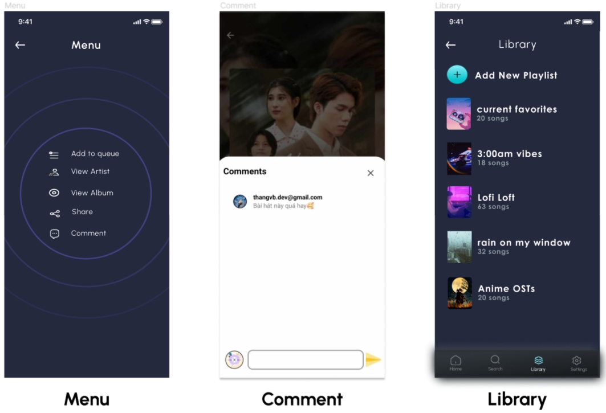
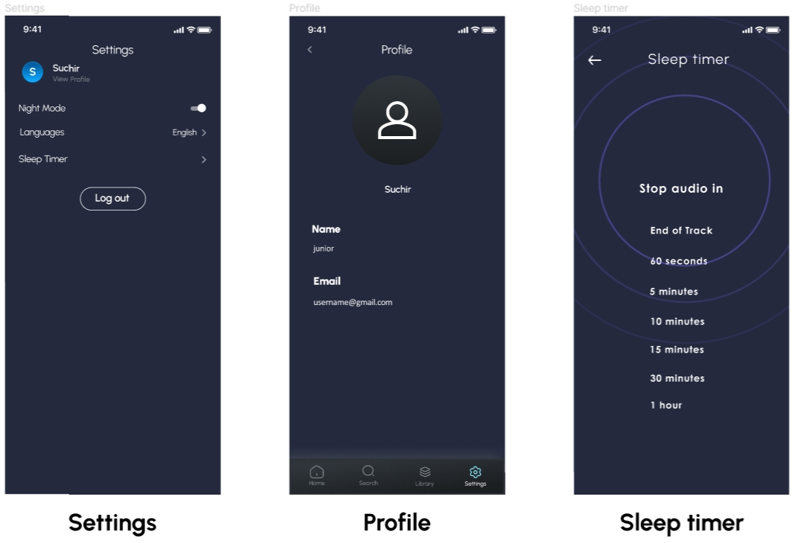

# Soul Sound Mobile Application🎵

Soul Sound is a music streaming application designed for Android devices, providing a rich and diverse music experience. Soul Sound aims to deliver a simple, effective, and personalized music streaming experience to users.

## ✨ Key Features

### 1. Account
- Sign up, log in, and log out.
- Recover forgotten passwords.

### 2. Music Playback
- Play, pause, and seek songs.
- View lyrics.
- Add songs to favorites and leave reviews.
- Skip to the next or previous song.
- Background playback with minimized player.
- Quick song search.
- Comment.
- Save favorite playlists and resume playback position.

### 3. Settings
- Switch between light and dark modes.
- Sleep timer.
- Switch languages.

## 🛠️ Technologies Used
- **Java**, **Android Studio**, **SQLite**, **Figma**, **StarUML**.

## 🖼️ Preview
- **Sign in/up screen**

- **Forgot passowrd screen**

- **Home screen**

- **Music Player screen**



- **Settings screen**


## 🚀 Installation Guide

1. Clone the repository:
   ```bash
   git clone https://github.com/hoangnd107/soul-sound-mobile-app.git
   ```
2. Open the project in Android Studio.
3. Connect an Android device or start an emulator.
4. Build and run the application.

## 👨‍💻 Development Team
- **Vu Ba Thang**
- **Trinh Phuong Huyen**
- **Nguyen Duy Hoang**
- **Nguyen Thi Ngoc Anh**